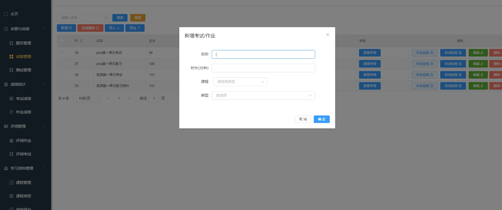
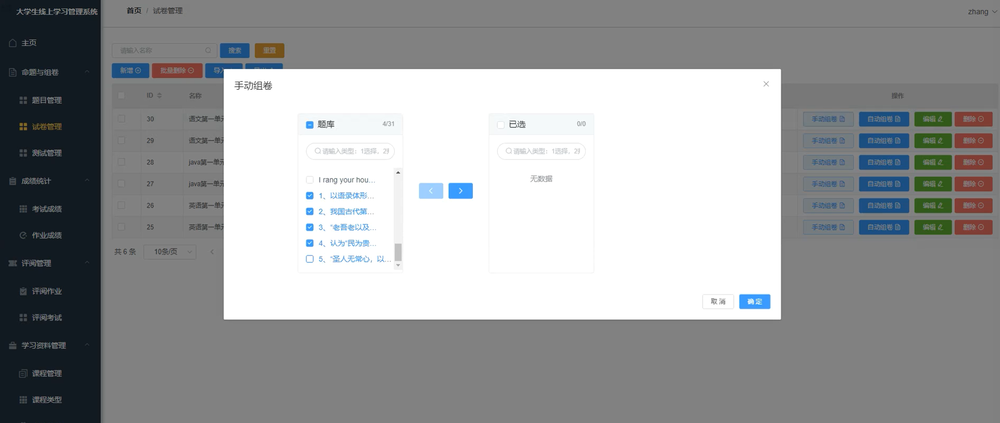
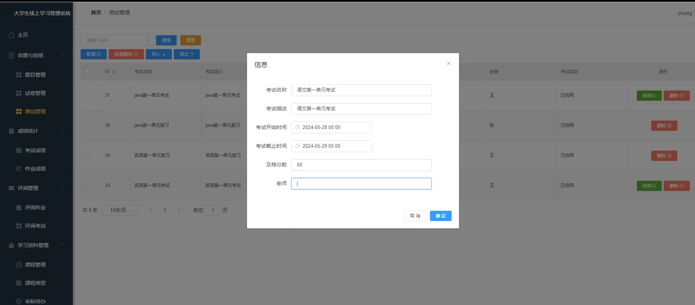
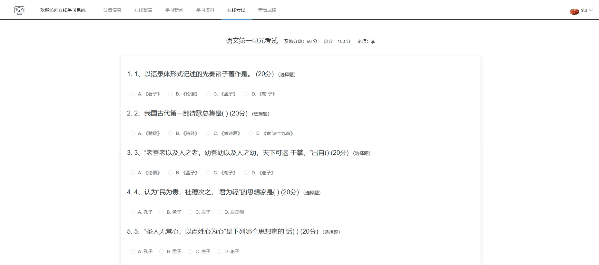
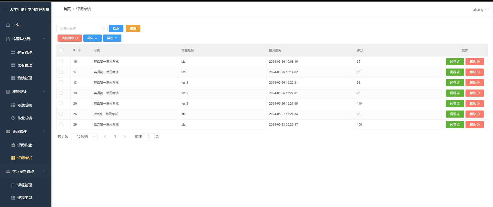
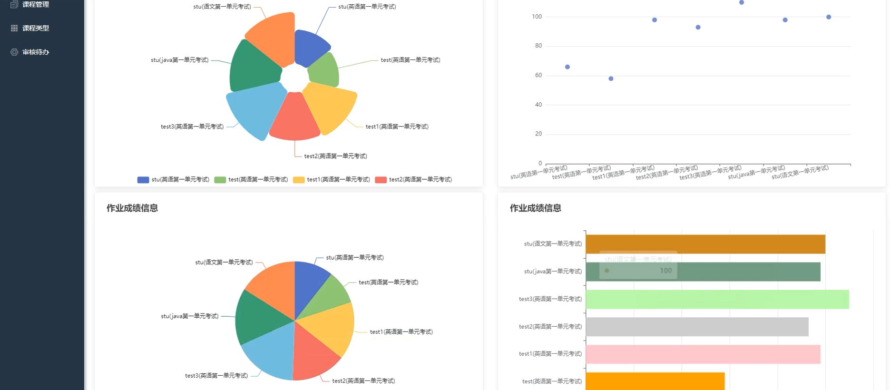
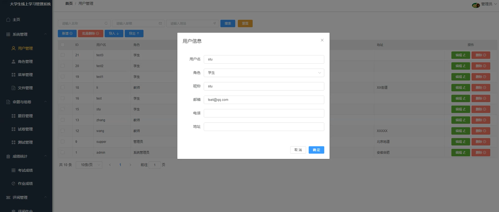
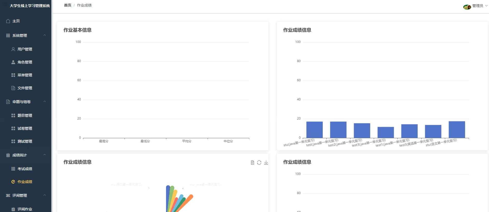
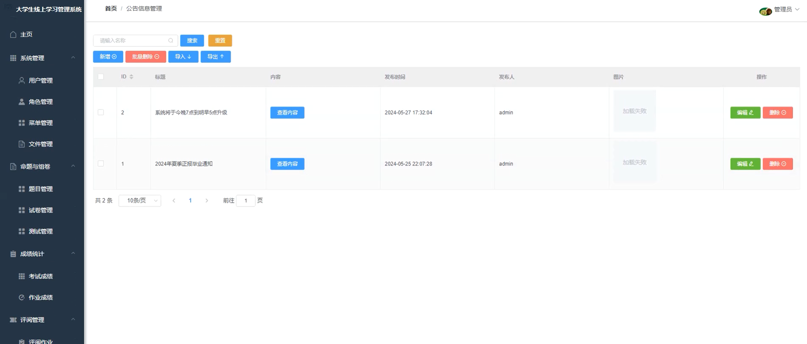

# 考试学习系统

#### 介绍
🔥🔥🔥本项目完全开源，采用的技术是SpringBoot+Vue+Mysql+Mybatis，项目非常的nice，带详细的部署教程。可以用于学习或者二次开发，感谢提出宝贵的建议，技术交流微：fly996868


#### 软件架构

系统环境：JDK = 11、MySQL =8、Maven >= 3.0、Node >= 12

基于技术：Spring Boot、Spring Security、MyBatis、Jwt、Vue、ECharts


#### 安装教程和使用说明

注意事项：

数据库每个人的版本都不一样，建议使用数据库5.7,如果你导入的数据库有问题，请按照下面的来操作。

Specified key was too long； max key length is 767 bytes解决方案

Between 5.6.3 and 5.7.7

设置mysql的innodb参数：

请先运行：


> set global innodb_large_prefix = ON;
> 
> SET GLOBAL innodb_file_format=Barracuda;
> 
> SET GLOBAL innodb_file_per_table=ON;
> 
`npm install -y`

报错用这个命令


```
npm install -g mirror-config-china

npm i

npm install --legacy-peer-deps

```


安装echarts

####  安装 cnpm

`npm install cnpm -g`

##### 最新稳定版


> cnpm install echarts --save
> 


#### 系统展示

系统分为前后台的，前台的使用者是用户，后台的使用者是管理员。

系统的展示如下所示：













#### 参与贡献

1.  程序员小孟
2.  潘少


#### 特技

1, 开源不易，整理项目不易，star、fork支持下，可以给我们提出宝贵意见，非常感谢。

2，更多优质项目，我会持续更新，专业开发20年，嘿嘿……

3， 感谢：www.javaclimb.com
